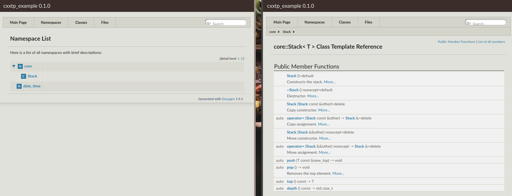
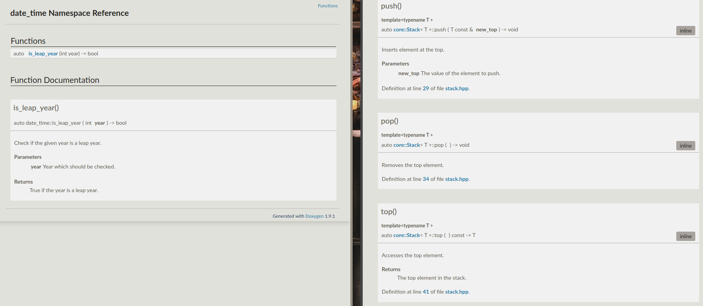

# cxxtp example

This repository shows the usage of the [cxxtp][] template project.

## Example screenshots

---

---

---

---

## License

The project is licensed under the MIT license. See [LICENSE](LICENSE) for more
information.

[cxxtp]: https://github.com/sblumentritt/cxxtp
